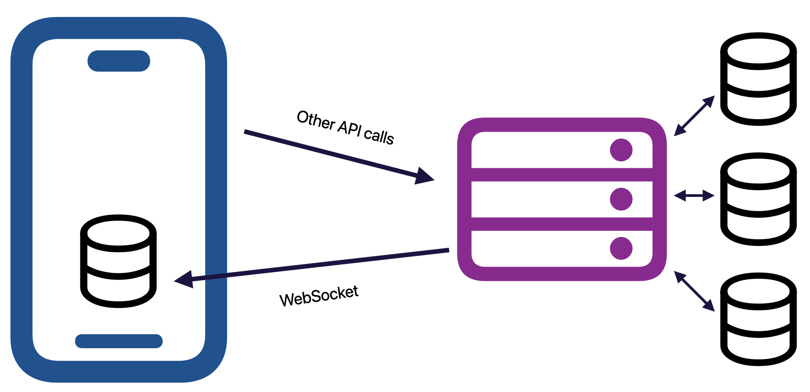

# BokBank

This is a demo project written for a talk on OpenTelemetry given at /dev/world in May 2024.
  

>[!WARNING]
>This code is for demonstration purposes only. Its mostly functional but was thrown together in a hurry. It's not robust, its not secure, it takes a lot of shortcuts. It comes with no warranty and no support.

## Overview

This project includes two components: a minimal iOS bank app that shows your account balance, a list of transactions, and allows you to make transfers between your accounts. It also includes a minimal API using Hummingbird to facilitate it. Both ends use GRDB to support database access and value observation (reactive reads), and employ a WebSocket connection between client and server to replicate those reads to the client side.

The purpose of this project is to show usage of [swift-distributed-tracing](https://github.com/apple/swift-distributed-tracing) and how you might employ that in an iOS app and on a backend and tie the two traces together.

## Getting Started

This project requires Swift 5.10 or higher for the server, and Xcode 15.3 or higher for the app.

1. Choose a telemetry backend and get it going. For the demo I used [Honeycomb's](https://honeycomb.io) free tier, but [Jaeger](https://www.jaegertracing.io) or [Grafana](https://grafana.com) are also good open-source choices.
2. I recommend running an [OpenTelemetry Collector](https://opentelemetry.io/docs/collector/) in docker on your local machine and configuring it to forward traces to your backend.
3. Build and run the server, either using `swift run` in the Server directory, or using the `server` scheme in Xcode.
4. Build and run the app.
5. You should see traces flowing through to your telemetry backend.

If you get stuck you can pass `-v` to the longer form of the server command (`swift run server serve -v`) and it'll log debug output, including the gRPC telemetry export. Likewise if you're running an OpenTelemetry collector looking at its log output will help (`docker logs -f <collector-container>`).

## License

This project is available under the MIT license. See the [LICENSE](LICENSE) file for more info.